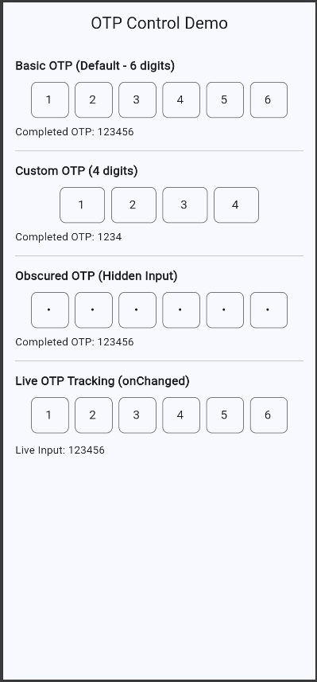
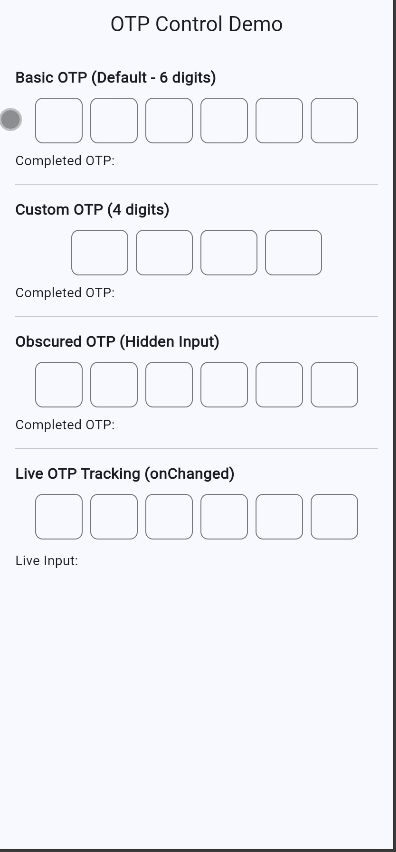

# OTP Control

A lightweight and customizable OTP (One-Time Password) input widget for Flutter.  
It provides a clean UI with automatic focus handling and useful callbacks for real-time OTP tracking.

---

## Features

- Custom OTP length (4–6 digits)
- Automatic focus movement between fields
- Backspace navigation support
- Obscure text mode for secure input
- onChanged callback for live input tracking
- onCompleted callback when OTP is fully entered
- Clean Material UI design

---

## Screenshots





---

## Installation

Add this to your `pubspec.yaml`:

```yaml
dependencies:
  otp_control: ^0.0.1
```

Then run:

```bash
flutter pub get
```

---

## Usage

Import the package:

```dart
import 'package:otp_control/otp_control.dart';
```

---

### Basic Usage

```dart
OtpField()
```

---

### Custom Length

```dart
OtpField(
  length: 4,
  fieldWidth: 60,
)
```

---

### Obscured OTP

```dart
OtpField(
  obscureText: true,
)
```

---

### Callbacks

```dart
OtpField(
  onChanged: (value) {
    print("OTP: $value");
  },
  onCompleted: (value) {
    print("Completed OTP: $value");
  },
)
```

---

## Example App

Check the `/example` folder for a complete working demo.

It includes:
- Default OTP input
- Custom OTP length
- Obscured input mode
- Live OTP tracking

---

## Project Structure

```
otp_control/
│
├── lib/
│   ├── otp_control.dart
│   └── src/
│       └── otp_field.dart
│
├── example/
├── test/
├── pubspec.yaml
├── README.md
├── LICENSE
└── CHANGELOG.md
```

---

## License

MIT License

---

## Authors (Group 3)

- 22K-4367 Ayan Hasan
- 22K-4376 Khubaib Ahmed Jamil
- 22K-4482 Muhammad Ahmed

---

## Notes

- OTP length is limited to 4–6 digits
- Designed for simple integration in Flutter apps